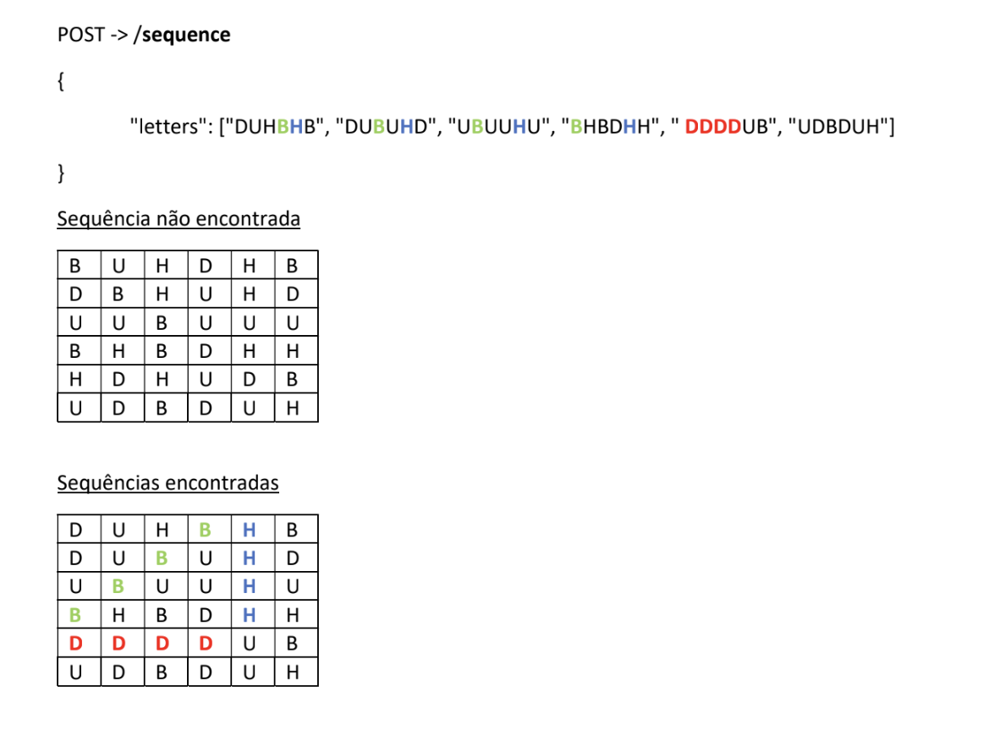

## Sequence Challenge

This project is an API REST and the is challenge to find the sequence of letters inside of matrix.


[](https://www.codacy.com/gh/PedroGaletti/sequence-golang/dashboard?utm_source=github.com&amp;utm_medium=referral&amp;utm_content=PedroGaletti/sequence-golang&amp;utm_campaign=Badge_Grade)


## Stack

- [Golang](https://go.dev) - Build fast, reliable, and efficient software at scale
- [Docker](https://www.docker.com) - Accelerate how you build, share, and run modern applications
- [MySQL](https://www.mysql.com) - Database management system, which uses the SQL language as an interface
- [Gin](https://github.com/gin-gonic/gin) - Gin is a HTTP web framework written in Go (Golang)

## Project structure

```
$PROJECT_ROOT
├── assets            # Image files
├── cmd
│   └── sequence      # Sequence and stats api logic
├── configs           # Dot env and log configs
└── db                # Database logic and connection 
```

## Environment Variables

```
Variable                | Type    | Description                       | Default
----------------------- | ------- | --------------------------------- | ------------------------
GIN_MODE                | string  | Interval time of the cron         | debug
LOG_LEVEL               | string  | Leveled Logging                   | info
SQL_DB                  | string  | Leveled Logging                   | challenge
SQL_HOST                | string  | Leveled Logging                   | 127.0.0.1
SQL_PASSWORD            | string  | Leveled Logging                   | root
SQL_PORT                | string  | Leveled Logging                   | 3308
SQL_USER                | string  | Leveled Logging                   | root
```


## Make commands:

Assuming that you have already cloned the project and the [Go](https://golang.org/doc/install) is installed, ensure that all dependencies are vendored in the project:

```
make install
```

To build the application:

```
make build
```

To run the application local:

```
make run
```

## URL Requests

- [POST](http://localhost:8080/sequence) - /sequence
- [GET](http://localhost:8080/sequence/stats) - /sequence/stats

## Author

- [@pedrogaletti](https://www.github.com/PedroGaletti)